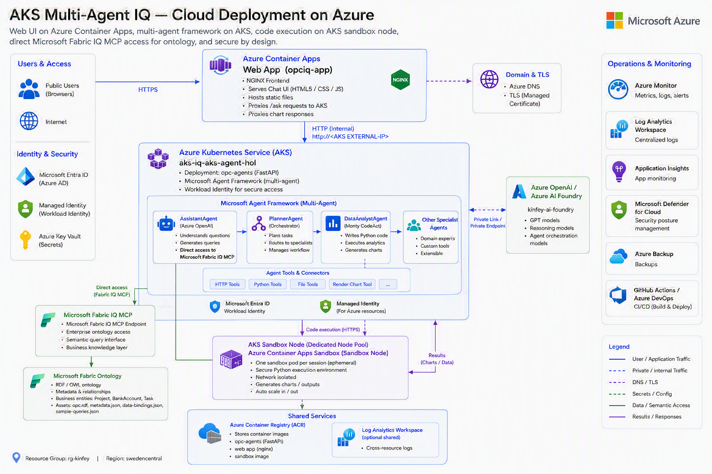

# AI Company — Enterprise Ontology + Fabric IQ + Agents

An end-to-end enterprise AI transformation sample that turns connected business knowledge into a
queryable ontology layer, exposes it through an **MCP server**, drives it with a **Microsoft Agent
Framework** multi-agent workflow, and serves answers, charts, and email sharing through a
**FastAPI backend** and the mobile-friendly **AI Company** Copilot.

The sample enterprise domain uses 3 entities — `Project`, `BankAccount`, and `Task`. The existing
ontology filename `opc.rdf` is retained as an implementation artifact.

> English README. 中文版见 [README.zh.md](README.zh.md).

## Architecture

```text
   AI Company browser/mobile UI
      |  POST /ask                 POST /send-email
      v                                  |
+--------------------------------------------------------------+
|  app/  ·  AI Company Chat (responsive HTML5 + CSS3 + JS)       |
+--------------------------------------------------------------+
      |
      v
+--------------------------------------------------------------+
|  agents/api.py  ·  FastAPI                                    |
|  GET /  POST /ask  GET /charts/{name}  POST /send-email       |
+--------------------------------------------------------------+
      | run_pipeline()                         | ACS Email SDK
      v                                        v
+--------------------------------------------------------------+
|  agents/  ·  Microsoft Agent Framework  (SequentialBuilder)  |
|                                                              |
|   AssistantAgent  ------------->  DataAnalystAgent           |
|   (Azure OpenAI)                  (Monty CodeAct)            |
+--------|-----------------------------------|-----------------+
         | MCP (stdio)                        | render_chart (matplotlib)
         v                                    v
+----------------------------+   +-----------------------------+
|  mcp/  ·  MCP Server        |   |  agents/ontology_charts/    |
|  describe_ontology,         |   |  *.png  (saved chart)       |
|  get_related, aggregate ... |   +-----------------------------+
+--------|-------------------+
         | parses
         v
+--------------------------------------------------------------+
|  dataIQ/  ·  Ontology + Data                                 |
|  opc.rdf  ·  data-bindings.json  ·  data/*.json              |
+--------------------------------------------------------------+
                                               |
                                               v
                              +---------------------------------+
                              | Azure Communication Services     |
                              | Email + answer/chart attachment  |
                              +---------------------------------+
```

**Flow:** a user question hits `POST /ask` → the `SequentialBuilder` workflow runs
`AssistantAgent` (queries the ontology via the MCP server) → `DataAnalystAgent` (writes Python in a
Monty CodeAct sandbox that calls the host `render_chart` tool to produce a PNG) → the API returns
the **text answer + chart image**. The user can then choose **Send result to Email**; the backend
calls Azure Communication Services Email and attaches the chart when one exists.

## Folder contents

| Folder | Contents |
|---|---|
| [dataIQ/](dataIQ) | The **ontology and mock data** (Fabric IQ concepts). `ontology/opc.rdf` (entity types, properties, relationships in RDF/OWL), `ontology/metadata.json`, `bindings/data-bindings.json` (entity/relationship → OneLake source mapping), `data/*.json` (Project, BankAccount, Task instances), `queries/sample-queries.json` (NL2Ontology examples). See [dataIQ/README.md](dataIQ/README.md). |
| [mcp/](mcp) | The **Model Context Protocol server** (`server.py`) that parses the ontology + bindings + data and exposes query tools (`describe_ontology`, `list_instances`, `get_instance`, `get_related`, `aggregate`). `requirements.txt`, `README.md`. See [mcp/README.md](mcp/README.md). |
| [agents/](agents) | The **Microsoft Agent Framework multi-agent app**. `opc_agents/` (config, AssistantAgent + MCP, DataAnalystAgent + Monty CodeAct, SequentialBuilder workflow), `api.py` (FastAPI), `test_workflow.py` (offline + live tests), `ontology_charts/` (generated PNGs), `.env` / `.env.example`. See [agents/README.md](agents/README.md). |
| [app/](app) | The mobile-friendly **AI Company** chat app (`index.html`, `styles.css`, `app.js`). Vanilla HTML5/CSS3/JS, responsive + dark mode, calls `/ask` and `/send-email`, and renders answers and charts. |
| [../.vscode/](../.vscode) | `mcp.json` — wires the MCP server into VS Code. |
| [cloud/](cloud) | **Azure deployment (Bicep)** — provisions AKS, Container Apps, a session-pool sandbox, ACS Email with an Azure-managed domain, ACR, and Log Analytics. See [cloud/README.md](cloud/README.md). |

## Prerequisites

- **conda** environment `agentdev` (Python 3.12) with the packages installed.
- An **Azure OpenAI / Azure AI Foundry** deployment (for the agents and live tests).
- Azure CLI (`az login`) if you use `AzureCliCredential` instead of an API key.

## Setup

```bash
# 1. Activate the environment
conda activate agentdev

# 2. Install dependencies
pip install -r mcp/requirements.txt
pip install -r agents/requirements.txt

# 3. Configure Azure OpenAI
cp agents/.env.example agents/.env
# Edit agents/.env:
#   AZURE_OPENAI_ENDPOINT=https://<resource>.openai.azure.com/   (or *.services.ai.azure.com/)
#   AZURE_OPENAI_MODEL=<deployment-name>
#   AZURE_OPENAI_API_VERSION=2024-10-21
#   AZURE_OPENAI_API_KEY=...            # OR leave empty and run `az login`
#   AZURE_COMMUNICATION_SERVICE_CONNECTION_STRING=...
#   AZURE_COMMUNICATION_SERVICE_SENDER_ADDRESS=DoNotReply@<verified-domain>
```

## Execution steps

### 1) Verify the MCP server (no Azure required)

```bash
python mcp/server.py --selftest
# Lists entities/relationships and runs sample queries against dataIQ.
```

### 2) Run the agent tests

```bash
cd agents
python test_workflow.py            # offline: chart rendering + MCP tool discovery
python test_workflow.py --live "What is the total budget by project status? Draw a bar chart."
```

### 3) Start the API + chat web app

```bash
cd agents
uvicorn api:app --port 8000
# Open http://127.0.0.1:8000/ in a browser and start chatting.
```

The chat UI (served from `app/`) sends questions to `POST /ask` and renders the answer text plus
the generated chart image. Each returned result also offers an email action; the backend sends
the answer and optional chart attachment with Azure Communication Services Email.

### 4) (Optional) Use the MCP server directly

- In **VS Code**: `.vscode/mcp.json` registers the `opc-ontology` server.
- In **Claude Desktop** or any MCP client: run `python mcp/server.py` over stdio.

## Cloud deployment (Azure)

The [cloud/](cloud) folder deploys the whole app to Azure with **Bicep** into the
resource group `rg-multiagent-iq` (`swedencentral`). The web UI and the MCP+dataIQ
service run on **Azure Container Apps**, the agents run on **AKS**, and an ACA
**dynamic session pool** provides the isolated sandbox node for code execution.



```text
                         +------------------------------------------+
   Employees     ─────▶  |  ACA: AI Company (opciq-app) [nginx]    |
                         |  proxies /ask, /charts, /send-email      |
                         +---------------------┬--------------------+
                                               │  http://<AKS EXTERNAL-IP>
                                               ▼
                         +------------------------------------------+
                         |  AKS: aks-iq-aks-agent-hol               |
                         |  Deployment "opc-agents" (FastAPI)       |
                         |  Microsoft Agent Framework workflow:     |
                         |   AssistantAgent + DataAnalystAgent      |
                         |   Entra ID auth via Workload Identity ───┼──▶ Azure OpenAI
                         +----------┬--------------------┬----------+     (my-ai-foundry)
                                    │ stdio MCP          │ code-exec offload
                                    │ (bundled)          ▼
                                    │        +--------------------------------+
                                    │        |  ACA session pool (sandbox)    |
                                    │        |  opciqsandbox  (PythonLTS)     |
                                    │        +--------------------------------+
                                    ▼
                         +------------------------------------------+
                         |        Microsoft Fabric Ontology MCP     |
                         +------------------------------------------+
                                    |
                                    +------------------------------▶ ACS Email
                                                                     answer + chart

   Shared: Azure Container Registry (opciqacr…) + Log Analytics (opciq-logs)
```

| Component | Azure service | Resource |
|---|---|---|
| Chat web UI | Container Apps (nginx) | `opciq-app` |
| Agents (FastAPI workflow) | **AKS** | `aks-iq-aks-agent-hol` / Deployment `opc-agents` |
| Sandbox node (code execution) | Container Apps **session pool** | `opciqsandbox` (PythonLTS) |
| MCP + dataIQ over HTTP | Container Apps | `opciq-mcp-dataiq` |
| Image registry | Container Registry | `opciqacr…` |
| Monitoring | Log Analytics | `opciq-logs` |
| LLM | Azure OpenAI / Foundry | `my-ai-foundry` |
| Email delivery | Azure Communication Services Email | `opciq-acs-*` + Azure-managed domain |

**Auth (passwordless):** the AKS agents call Azure OpenAI with **Entra ID** via
AKS **Workload Identity** (a federated managed identity granted *Cognitive
Services OpenAI User* on Foundry) — no `AZURE_OPENAI_API_KEY` in the cloud. The
Container Apps pull images from ACR using registry admin credentials.

**Email security:** the deployment retrieves the ACS connection string at runtime and stores it in
the AKS `opc-agents-secret`. The browser never receives ACS credentials.

**Deploy:**

```bash
cd cloud
bash scripts/deploy.sh      # builds 3 images, deploys Bicep, wires AKS ↔ web app
```

See [cloud/README.md](cloud/README.md) for the full step-by-step and teardown.

## Tech stack

- **Ontology**: RDF/OWL (Fabric IQ ontology concepts)
- **MCP**: `mcp` Python SDK (FastMCP, stdio)
- **Agents**: Microsoft Agent Framework (`agent-framework`, `agent-framework-monty`, `SequentialBuilder`)
- **LLM**: Azure OpenAI / Azure AI Foundry via `OpenAIChatCompletionClient`
- **Charts**: matplotlib (host tool called from the Monty CodeAct sandbox)
- **API**: FastAPI + Uvicorn
- **Frontend**: HTML5 + CSS3 + vanilla JavaScript
